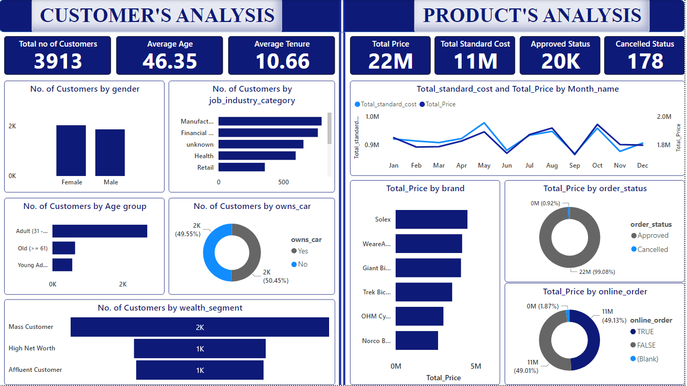

q# Customer-Product_Analysis_Project

---

### Project Overview:
The project aims to improve customer satisfaction, boost revenue growth and optimize the customer product ecosystem by analyzing customer segmentation and product performance.

### Data Source:
The data, for this project is sourced from Sprocket Central Pty Ltd as part of a collaboration with KPMG. It comprises customer demographics and transaction logs giving us a perspective to gain insights, into customer behavior and product performance.

### Tools:
I used Power BI for visualization purposes and Power query editor, for cleaning and analyzing the data. 

### Exploratory Data Analysis
* Customer Demographics: I analyzed the customer base by looking at factors such, as gender distribution, job categories, age groups, car ownership and wealth segments.
* Product performance: I analyzed the metrics related to the product and identified the cost and price for each month, the price categorized by brand well as the order status and online availability.

### Recommendations:
• Based on the analysis of customer behavior I would suggest these recommendations;
* It would be beneficial to consider implementing feedback systems, like surveys or reviews. These mechanisms can provide insights into customer satisfaction levels and areas that need improvement.
* Another effective strategy is to reward customers by offering deals and discounts. This not encourages repeat business. It also helps foster a sense of appreciation, among customers. 
_**These actions can help understand customer needs better and enhance their experience with the brand**_.

• Recommendations, for Product Analysis;
* Introduce products that align with customer preferences and gradually phase out underperforming ones to streamline our offerings.
* Implement flexible pricing strategies to maximize revenue generation.
* Prioritize initiatives aimed at improving quality based on customer feedback.

### Limitations
 * I had to remove blank spaces and null values from the Date of Birth (DOB) and Tenure columns as they could have impacted the accuracy of my analysis conclusions.
 * I got rid of columns that were not relevant to the analysis.
 * Extracted the age information from the DOB column and added a column to categorize individuals into different age groups.
 * Developed a calendar table to obtain the year, month and corresponding month names.

#### You can interact with the dashboard [here](https://app.powerbi.com/links/Du_ousn8j1?ctid=7a7d9927-84e9-4910-b10f-850c64b28029&pbi_source=linkShare)

